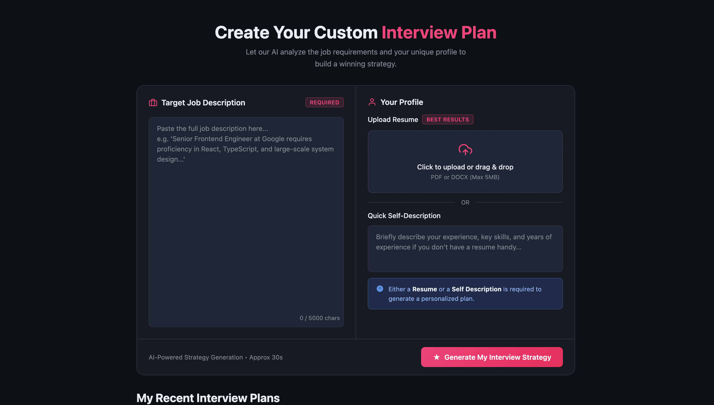
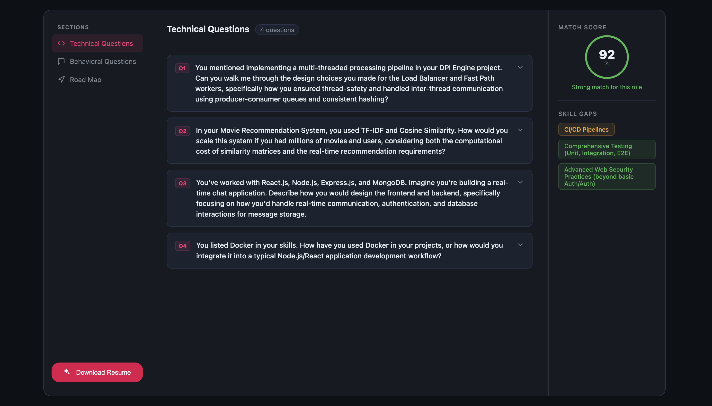

# 🚀 GenAI Job Preparation Web Application

An AI-powered interview preparation platform that analyzes a **candidate's resume and job description** to generate a **personalized interview preparation strategy**.

The system evaluates candidate–job compatibility and provides:

- Technical interview questions
- Behavioral interview questions
- Skill gap analysis
- Match score
- Learning roadmap

Built using **React, Node.js, Express, MongoDB, and Google Generative AI**.

---

# 🧠 Tech Stack

## Frontend
- React.js
- Tailwind CSS

## Backend
- Node.js
- Express.js

## Database
- MongoDB

## AI Integration
- Google Generative AI (Gemini)

## Other Tools
- Multer (File Upload)
- pdf-parse (Resume Parsing)
- Zod (Schema Validation)
- JWT Authentication

---

# 📸 Screenshots

## Interview Strategy Generator



## AI Technical Question Analysis



---

# ✨ Features

## 🤖 AI Interview Strategy
Generate a personalized interview preparation plan using your **resume and job description**.

## 🧠 AI Technical Questions
Automatically generate **role-specific technical interview questions** based on your skills.

## 📊 Match Score
Calculate compatibility between the candidate and job role.

Example:

Match Score: **92%**

Strong match for this role.

## ⚠️ Skill Gap Analysis
Identify missing skills such as:

- CI/CD pipelines
- Comprehensive testing
- Advanced security practices

## 📄 Resume Parsing
Extracts relevant skills and information from uploaded resumes.

## 📚 Learning Roadmap
Provides recommendations on what to study before interviews.

---

# 🏗 Project Structure

```
├── 📁 Backend
│   ├── 📁 src
│   │   ├── 📁 config
│   │   │   └── 📄 database.js
│   │   ├── 📁 controllers
│   │   │   ├── 📄 auth.controller.js
│   │   │   └── 📄 interview.controller.js
│   │   ├── 📁 middlewares
│   │   │   ├── 📄 auth.middleware.js
│   │   │   └── 📄 file.middleware.js
│   │   ├── 📁 models
│   │   │   ├── 📄 blacklist.model.js
│   │   │   ├── 📄 interviewReport.model.js
│   │   │   └── 📄 user.model.js
│   │   ├── 📁 routes
│   │   │   ├── 📄 auth.routes.js
│   │   │   └── 📄 interview.routes.js
│   │   ├── 📁 services
│   │   │   ├── 📄 ai.service.js
│   │   │   └── 📄 temp.js
│   │   └── 📄 app.js
│   ├── ⚙️ .gitignore
│   ├── ⚙️ package-lock.json
│   ├── ⚙️ package.json
│   ├── 📄 packages.txt
│   └── 📄 server.js
├── 📁 Frontend
│   ├── 📁 public
│   │   └── 🖼️ vite.svg
│   ├── 📁 src
│   │   ├── 📁 features
│   │   │   ├── 📁 auth
│   │   │   │   ├── 📁 components
│   │   │   │   │   └── 📄 Protected.jsx
│   │   │   │   ├── 📁 hooks
│   │   │   │   │   ├── 📄 useAuth.js
│   │   │   │   │   └── 📄 useInterview.js
│   │   │   │   ├── 📁 pages
│   │   │   │   │   ├── 📄 Login.jsx
│   │   │   │   │   └── 📄 Register.jsx
│   │   │   │   ├── 📁 services
│   │   │   │   │   └── 📄 auth.api.js
│   │   │   │   ├── 📄 auth.context.jsx
│   │   │   │   └── 🎨 auth.form.scss
│   │   │   └── 📁 interview
│   │   │       ├── 📁 api
│   │   │       ├── 📁 hooks
│   │   │       │   └── 📄 useInterview.js
│   │   │       ├── 📁 pages
│   │   │       │   ├── 📄 Home.jsx
│   │   │       │   └── 📄 Interview.jsx
│   │   │       ├── 📁 services
│   │   │       │   └── 📄 interview.api.js
│   │   │       ├── 📁 style
│   │   │       │   ├── 🎨 home.scss
│   │   │       │   └── 🎨 interview.scss
│   │   │       └── 📄 interview.context.jsx
│   │   ├── 📁 styles
│   │   │   └── 🎨 buttons.scss
│   │   ├── 📄 App.jsx
│   │   ├── 📄 app.routes.jsx
│   │   ├── 📄 main.jsx
│   │   └── 🎨 style.scss
│   ├── ⚙️ .gitignore
│   ├── 📝 README.md
│   ├── 📄 eslint.config.js
│   ├── 📄 folder.txt
│   ├── 🌐 index.html
│   ├── ⚙️ package-lock.json
│   ├── ⚙️ package.json
│   ├── 📄 packages.txt
│   └── 📄 vite.config.js
└── 📁 assets
    ├── 🖼️ interview.png
    └── 🖼️ result.png
```

---


---

# ⚙️ Installation

Clone the repository

```bash
git clone https://github.com/thepraveenrajput/GenAI-Job-Preparation-WebApp.git
cd GenAI-Job-Preparation-WebApp
```

# Backend Setup

```bash
cd Backend
npm install
```
Create a .env file in the Backend folder:
```
PORT=3000
MONGO_URI=your_mongodb_connection
GOOGLE_GENAI_API_KEY=your_google_ai_api_key
JWT_SECRET=your_jwt_secret
```

Run the backend server:
```
npm start

```
# Frontend Setup
```
cd Frontend
npm install
npm run dev
```

The application will run on:
```
http://localhost:5173
```

# Usage

- Paste the Job Description

- Upload your Resume

- Click Generate Interview Strategy

- AI analyzes the profile

## The system generates:

- Match score

- Technical questions

- Behavioral questions

- Skill gap insights

- Learning roadmap

## Example Output:
```
Match Score: 92%

Strengths
- React.js
- Node.js
- MongoDB
- API development

Skill Gaps
- CI/CD pipelines
- Advanced testing
- Security practices
```

## Environment Variables
```
MONGO_URI=
GOOGLE_GENAI_API_KEY=
JWT_SECRET=
```
## Future Improvements

- AI mock interview simulator

- Real-time coding interview environment

- Resume ATS score analyzer

- Job recommendation engine

- Interview analytics dashboard

## Contributing

Contributions are welcome.

### Steps:

- Fork the repository

- Create a new branch

- Commit your changes

- Push to the branch

- Open a Pull Request

## License

### MIT License
